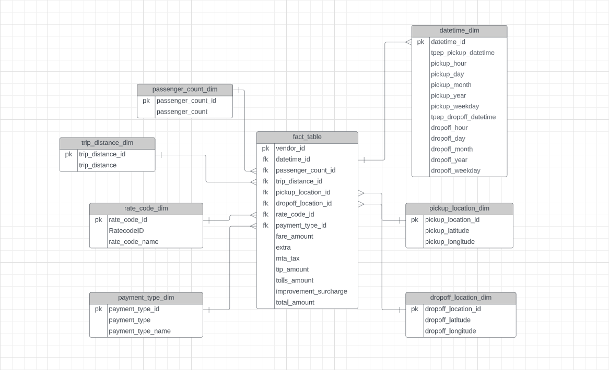

## Summary: This is an end-to-end data engineering/analysis project that focuses on making a data pipeline, querying data, and visualizing it

## Table of Contents
- [The Goal](The_Goal)
- [Data Source](data_source)
- [Tech Stack](tech_stack)
- [Creating Data Model](data_model)
- Creating Data Pipeline
- BigQuery Analysis
- Building a Dashboard

## The Goal
Learn how to transform data, use cloud storage servers, understand SQL, and visualize data

## Tech Stack
- Python
- Jupyter
- Mage
- Google Cloud Storage
- BigQuery (SQL)
- Compute Engine
- Looker Studio

## Data Source
- [TLC Trip Record Data](https://www.nyc.gov/site/tlc/about/tlc-trip-record-data.page)

## Creating Data Model
Used Lucid app to create a data model/flowchart to refer to when transforming original data

## Creating Data Pipeline
I first wrote and ran the transformation code in Jupyter Notebook to visually see what change is happening. This made the process in Mage a whole lot easier. I had to use Google Compute engine to make an instance that would then connect to Mage so I can use the interface. I used Mage because it's easier to make the pipeline and connect to BigQuery using it.

## BigQuery Analysis
Used BigQuery to perform some EDA and make a new table to use for visualization in LookerStudio. Here's the EDA performed: [EDA](https://github.com/natalyabarnum/Uber-Data-Pipeline-Project/tree/main/sql_files)

## Building a Dashboard
Created an interactive dashboard to visually see and interpret the data. Here's the dashboard: [Uber Dashboard](https://lookerstudio.google.com/reporting/face9c4c-b6dc-4e02-9176-449a4676039b)
